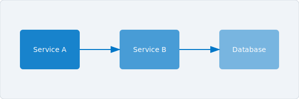

# 샘플 매뉴얼

이 페이지는 매뉴얼 템플릿이 지원하는 모든 시각 요소를 포함합니다.
브라우저와 PDF 출력에서 스타일이 올바르게 렌더링되는지 확인하는 데
사용합니다.

## 인라인 서식

일반 텍스트에 **굵게**, *기울임*, ***굵은 기울임***, `인라인 코드`,
~~취소선~~, 그리고 [하이퍼링크](https://example.com)를 사용할 수
있습니다. 키보드 단축키는 ++ctrl+shift+p++로 표기합니다.

HTML 사양은 W3C에서 관리합니다.

*[HTML]: Hyper Text Markup Language
*[W3C]: World Wide Web Consortium

---

## 리스트

### 비순서 리스트 (3단계)

- 과일
    - 감귤류
        - 오렌지
        - 레몬
    - 베리류
        - 블루베리
        - 딸기
- 채소
    - 근채류
        - 당근
        - 감자

### 순서 리스트 (3단계)

1. 환경 준비
    1. 의존성 설치
        1. 시스템 패키지
        2. 언어 런타임
    2. 인증 정보 구성
2. 애플리케이션 실행
    1. 데이터베이스 시작
    2. 서버 시작
3. 배포 확인

### 작업 리스트

- [x] 저장소 설정
- [x] CI 파이프라인 구성
- [ ] 문서 작성
- [ ] 첫 릴리스 태그

### 정의 리스트

MkDocs
:   Python으로 작성된 프로젝트 문서 전용 정적 사이트 생성기입니다.

Material for MkDocs
:   MkDocs용 테마로, 다양한 기능을 내장한 현대적이고 반응형인
    디자인을 제공합니다.

---

## 테이블

### 기본 테이블

| 컴포넌트   | 버전    | 상태        |
|-----------|---------|------------|
| 서버       | 2.4.0   | 안정        |
| CLI       | 1.8.3   | 안정        |
| 대시보드    | 0.9.1   | 베타        |

### 정렬 지정

| 왼쪽 정렬     | 가운데 정렬     | 오른쪽 정렬   |
|:-------------|:--------------:|-----------:|
| 행 1         |    알파         |      1,024 |
| 행 2         |    베타         |      2,048 |
| 행 3         |    감마         |      4,096 |

---

## 코드 블록

### 줄 번호 포함

```python linenums="1"
def fibonacci(n: int) -> list[int]:
    """처음 n개의 피보나치 수를 반환합니다."""
    seq = []
    a, b = 0, 1
    for _ in range(n):
        seq.append(a)
        a, b = b, a + b
    return seq
```

### 줄 번호 없음

```bash
curl -sSL https://example.com/install.sh | bash
```

### 다국어

=== "Python"

    ```python
    print("Hello, world!")
    ```

=== "Rust"

    ```rust
    fn main() {
        println!("Hello, world!");
    }
    ```

=== "Go"

    ```go
    package main

    import "fmt"

    func main() {
        fmt.Println("Hello, world!")
    }
    ```

---

## 어드모니션

!!! note
    **참고** 어드모니션입니다. 독자가 알아야 할 부가 정보를 전달할 때
    사용합니다.

!!! tip
    **팁** 어드모니션입니다. 모범 사례나 유용한 단축키를 안내할 때
    사용합니다.

!!! warning
    **경고** 어드모니션입니다. 주의가 필요한 상황에서 사용합니다.

!!! danger
    **위험** 어드모니션입니다. 데이터 손실이나 보안 문제를 일으킬 수
    있는 작업에 사용합니다.

!!! info
    **정보** 어드모니션입니다. 일반적인 맥락 정보를 전달할 때
    사용합니다.

!!! example
    **예시** 어드모니션입니다. 구체적인 시나리오로 개념을 설명할 때
    사용합니다.

??? note "접을 수 있는 어드모니션 (클릭하여 펼치기)"
    이 내용은 기본적으로 숨겨져 있으며, 독자가 제목을 클릭하면
    표시됩니다.

---

## 인용문

> 문서화는 미래의 자신에게 보내는 러브레터입니다.
>
> — Damian Conway

---

## 이미지 및 도표



*그림 1 — 샘플 아키텍처 다이어그램*

---

## 각주

Bootroot는 베어메탈 호스트에서 서비스 수명 주기를 관리합니다[^1].
패키지 레지스트리와 연동하여 서명된 아티팩트를 가져옵니다[^2].

[^1]: 베어메탈 배포는 지연에 민감한 워크로드에서 컨테이너 오케스트레이션의
      오버헤드를 제거합니다.
[^2]: 아티팩트 서명은 신뢰 데이터베이스에 저장된 ed25519 키로 검증합니다.

---

## 제목 수준

### 3단계 제목

Lorem ipsum dolor sit amet, consectetur adipiscing elit. Sed do
eiusmod tempor incididunt ut labore et dolore magna aliqua.

#### 4단계 제목

Ut enim ad minim veniam, quis nostrud exercitation ullamco laboris
nisi ut aliquip ex ea commodo consequat.
